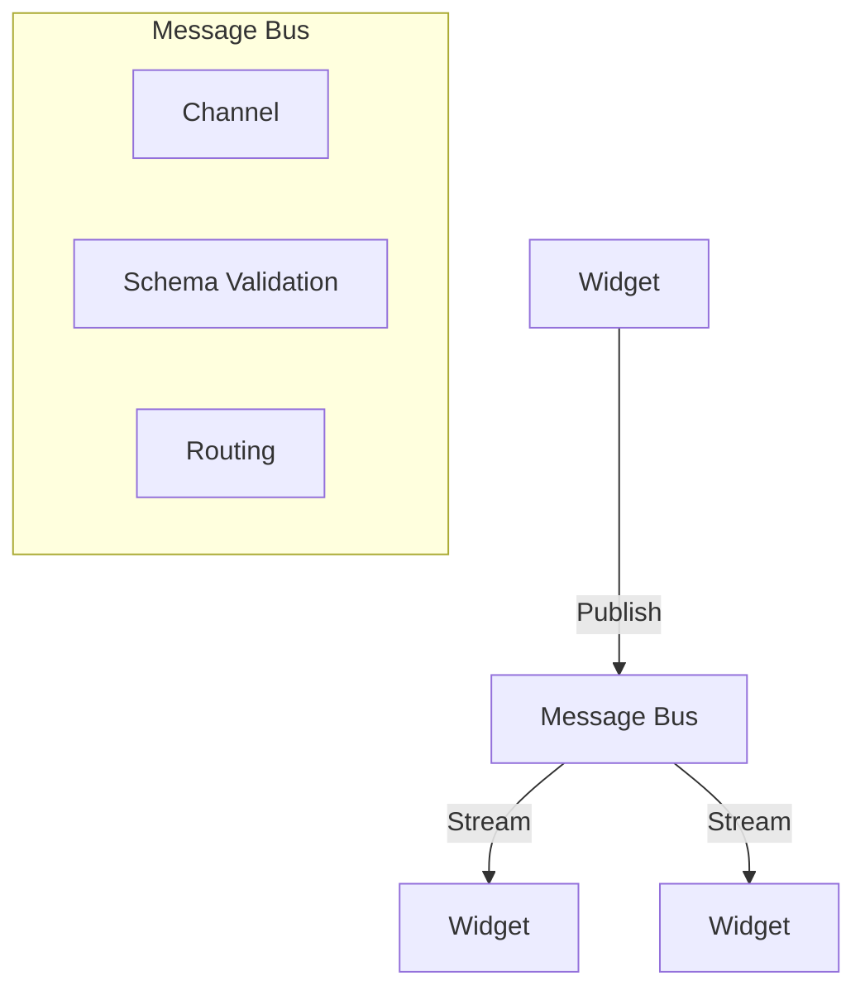
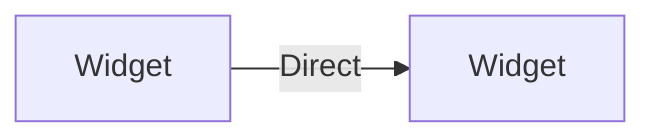
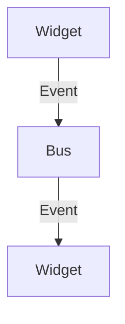

# RFC: Widget Communication System

## Summary
This RFC proposes a distributed widget communication system for Kontrol, enabling widgets to operate across different processes and machines while maintaining type-safe, real-time communication. The system uses Effect.ts's Stream and Channel primitives as its foundation.

## Background and Motivation

### Current State
- UI components are process-bound
- State management is local
- Communication is synchronous
- Resource allocation is static

### Pain Points
1. AI operations need specialized hardware
2. Large models can't run in browser
3. Resource utilization is inefficient
4. Scaling is difficult
5. State synchronization is complex

### Why Change is Needed
Modern AI applications require:
- Distributed processing
- Hardware flexibility
- Dynamic scaling
- Real-time updates
- Resource optimization

## Technical Architecture

### Core Components

1. **Widget Protocol**
```typescript
interface WidgetMessage<T> {
  id: string           // Unique message ID
  from: string         // Source widget ID
  to: string          // Target widget ID
  payload: T          // Schema-validated payload
  timestamp: number   // Message timestamp
}
```

2. **Communication Layer**


3. **Implementation with Effect**
```typescript
class WidgetChannel extends Effect.Service<WidgetChannel>() {
  static readonly live = Effect.gen(function*(_) {
    // Bounded hub for back-pressure
    const hub = yield* Hub.bounded<WidgetMessage>(100)
    
    return {
      publish: <T>(message: WidgetMessage<T>) =>
        Hub.publish(hub, message),
        
      subscribe: (pattern: SubscriptionPattern) =>
        Hub.subscribeScoped(hub).pipe(
          Stream.filter(matchesPattern(pattern))
        )
    }
  })
}
```

### Message Flow
1. Publisher serializes message
2. Schema validation
3. Message bus routing
4. Subscriber deserialization
5. Type-safe consumption

## Alternatives Considered

### 1. Direct Communication

Rejected due to:
- Poor scaling
- Complex error handling
- Tight coupling
- No back-pressure

### 2. Event Bus

Rejected due to:
- Type safety issues
- No streaming support
- Limited flow control
- Complex state sync

## Implementation Strategy

### Phase 1: Core Protocol (2 weeks)
1. Message format definition
2. Schema validation
3. Basic routing
4. Error handling

### Phase 2: Distribution (2 weeks)
1. Network transport
2. Service discovery
3. Health monitoring
4. Load balancing

### Phase 3: Developer Tools (2 weeks)
1. Debug tooling
2. Monitoring
3. Documentation
4. Examples

## Additional Considerations

### Security
- Message encryption
- Widget authentication
- Permission model
- Audit logging

### Performance
- Message batching
- Back-pressure handling
- Caching strategy
- Connection pooling

### Scalability
- Horizontal scaling
- Load distribution
- Resource limits
- Failure domains

### Monitoring
- Message metrics
- System health
- Error tracking
- Performance stats

## Success Metrics
1. Latency < 100ms for 99th percentile
2. Zero message loss
3. Automatic recovery from failures
4. Type safety at compile time
5. Resource cleanup guaranteed

## Risks and Mitigations

| Risk | Mitigation |
|------|------------|
| Network partition | Message persistence + replay |
| Resource exhaustion | Back-pressure + limits |
| Type mismatches | Schema validation |
| System overload | Load shedding |

## Next Steps
1. Implement core protocol
2. Build reference implementation
3. Create developer tools
4. Write documentation
5. Release beta version