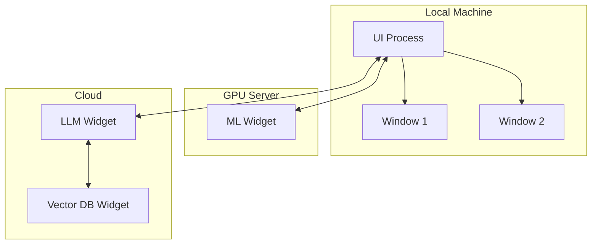
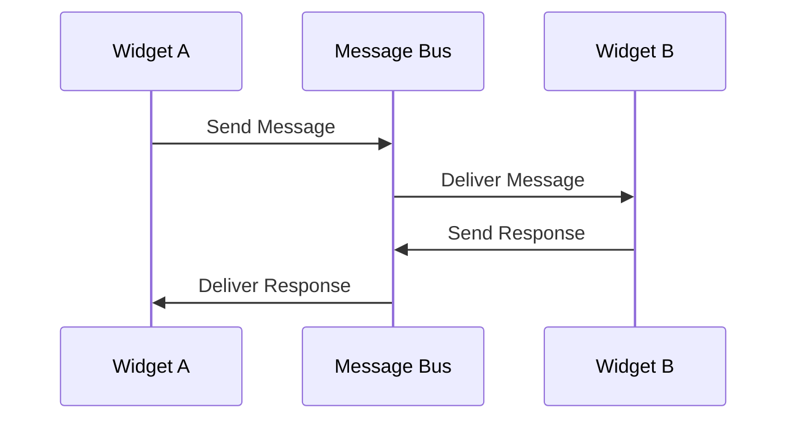
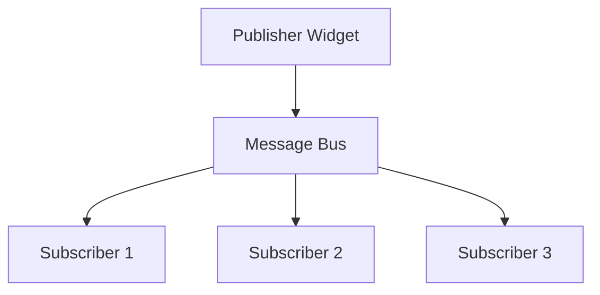
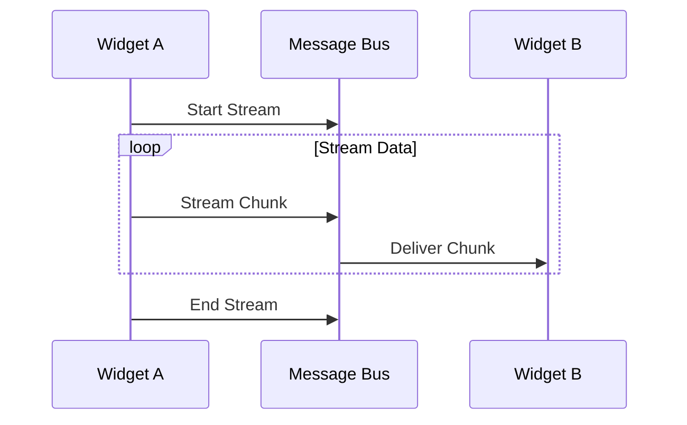
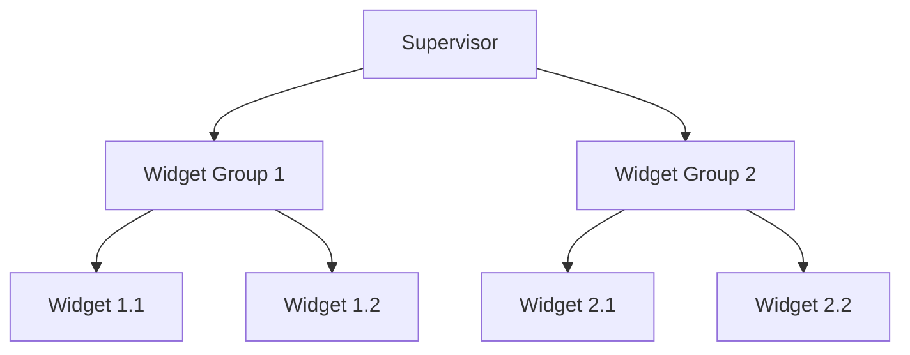
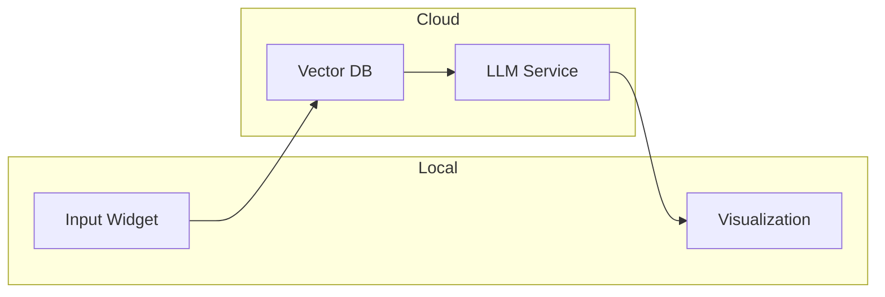
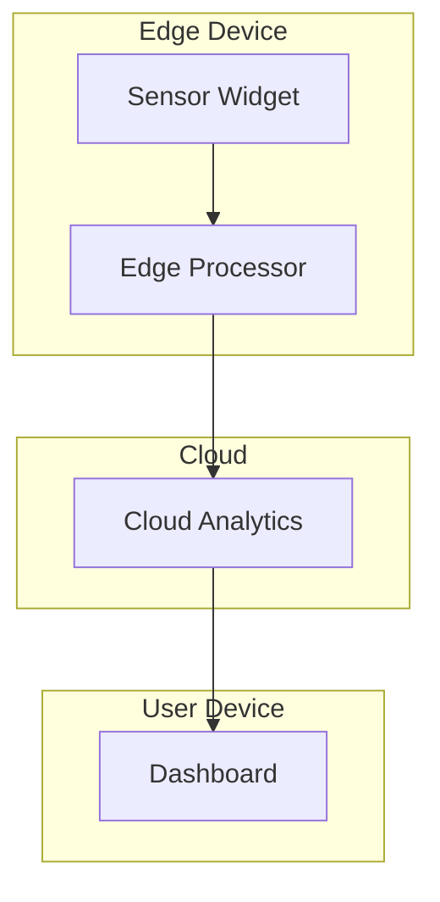

# Widget Communication in Kontrol

## Vision

In traditional applications, UI components are isolated and must live in the same process. This model breaks down in an AI-first world where:
- Widgets might need significant compute resources
- Different widgets might have different runtime requirements
- Some widgets might need specialized hardware (GPUs, TPUs)
- Widgets might need to scale independently

Kontrol introduces a distributed widget architecture where widgets can live anywhere - different processes, machines, or cloud services - while maintaining seamless communication and state synchronization.

## Core Concepts

### 1. Location-Independent Widgets

Widgets can live anywhere:
- Local process
- Remote server
- Cloud service
- Specialized hardware
- Edge devices

### 2. Communication Patterns

#### Async by Default

- All communication is asynchronous
- Built-in retry mechanisms
- Latency handling
- Error recovery

#### Pub/Sub

- Topic-based messaging
- Message persistence
- Delivery guarantees
- Back-pressure handling

#### Streaming

- Bi-directional streams
- Flow control
- Chunked transfer
- Stream composition

### 3. Supervision Tree

- Health monitoring
- Automatic restart
- Resource management
- Load balancing
- Scaling decisions

## Example Workflows

### 1. Distributed AI Pipeline

Components:
- Input Widget: Local UI for user interaction
- Vector DB: Cloud-based embedding storage
- LLM Service: GPU-powered language model
- Visualization: Local UI for results

### 2. Edge Computing Workflow

Components:
- Sensor Widget: Edge device data collection
- Edge Processor: Local data processing
- Cloud Analytics: Heavy computation
- Dashboard: User interface

## Why This Matters

### 1. Scalability
- Widgets can scale independently
- Resource-intensive widgets can run on appropriate hardware
- Natural load distribution
- Cost-effective resource usage

### 2. Flexibility
- Mix local and remote widgets
- Easy integration with cloud services
- Hardware-specific optimizations
- Geographic distribution

### 3. Reliability
- Automatic failover
- State replication
- Error isolation
- Graceful degradation

## Technical Considerations

### 1. Transport Layer
- WebSocket for real-time
- HTTP/2 for REST
- gRPC for high-performance
- MQTT for IoT scenarios

### 2. State Management
- Distributed state sync
- Conflict resolution
- State persistence
- Cache strategies

### 3. Security
- Authentication
- Authorization
- Encryption
- Audit logging

### 4. Monitoring
- Health checks
- Performance metrics
- Error tracking
- Usage analytics

## Next Steps

1. **Core Protocol**
   - Message format
   - Transport layer
   - Security model
   - State sync

2. **Infrastructure**
   - Widget registry
   - Supervision system
   - Scaling logic
   - Deployment tools

3. **Developer Tools**
   - Network inspector
   - State debugger
   - Performance monitor
   - Deployment dashboard

The future of widgets is distributed, and Kontrol provides the foundation for building this future.