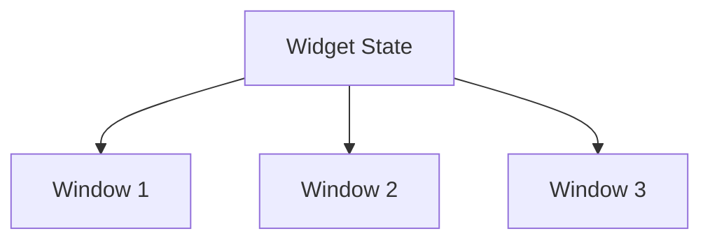
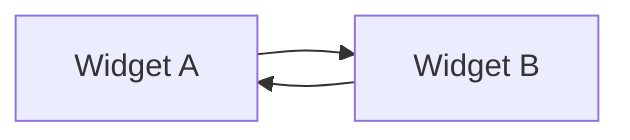
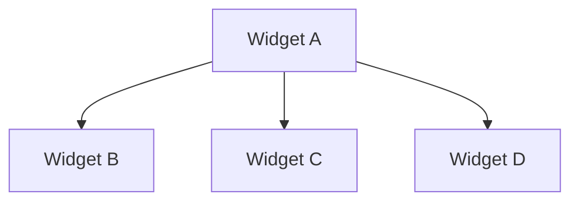
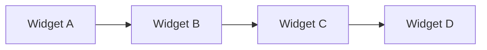
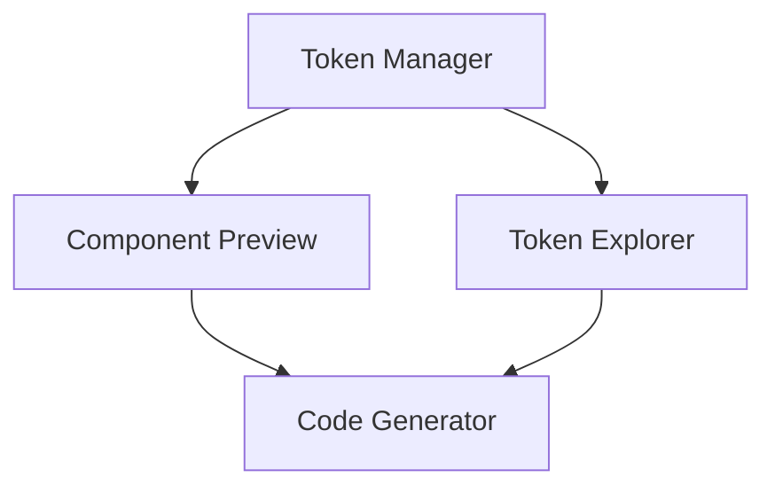
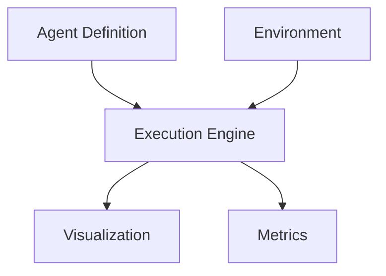

# Widget Communication in Kontrol

## Vision

In traditional applications, UI components are isolated, communicating through prop drilling or global state. This model breaks down when building AI-native applications that need rich, dynamic interactions between specialized components.

Kontrol introduces a new model: applications as networks of specialized widgets that can communicate and transform data. Think Unix pipes, but for AI operations - each widget does one thing well and can be composed with others to create powerful workflows.

## Core Concepts

### 1. Widget as a Buffer

Like Vim's buffers, widgets hold state and logic. Multiple windows can render different views of the same widget state. This separation enables:
- Multiple visualizations of the same data
- Consistent state across views
- Clear separation of concerns
- Efficient updates

### 2. Communication Patterns

#### Direct Communication

- Point-to-point messaging
- Type-safe payloads
- Bidirectional communication

#### Broadcast

- One-to-many communication
- State updates
- System events

#### Pipeline

- Data transformation chains
- Processing pipelines
- Sequential operations

## Example Workflows

### 1. Design System Token Studio

Components:
- Token Manager: Maintains design tokens
- Component Preview: Live component rendering
- Token Explorer: Visual token organization
- Code Generator: Exports token definitions

### 2. AI Agent Studio

Components:
- Agent Definition: Configure agent behavior
- Execution Engine: Runs agent logic
- Visualization: Shows agent state
- Metrics: Tracks performance
- Environment: Simulation space

## Why This Matters

### 1. Composability
- Build complex applications from simple widgets
- Mix and match widgets
- Create custom workflows
- Share widgets between applications

### 2. Flexibility
- Add new widgets without changing existing ones
- Create specialized views
- Adapt to different use cases
- Support multiple UI patterns

### 3. Power
- Rich interactions between widgets
- Complex data transformations
- State synchronization
- Real-time updates

## Design Principles

1. **Simplicity**
   - Each widget does one thing well
   - Clear communication patterns
   - Simple composition rules
   - Predictable behavior

2. **Type Safety**
   - Type-safe communication
   - Schema validation
   - Clear contracts
   - Compile-time checks

3. **Resource Safety**
   - Automatic cleanup
   - Memory management
   - Connection handling
   - Error boundaries

4. **Developer Experience**
   - Clear patterns
   - Easy composition
   - Rich tooling
   - Great documentation

## Next Steps

1. **Core Implementation**
   - Widget system
   - Communication layer
   - Resource management
   - Type system

2. **Developer Tools**
   - Widget explorer
   - Communication inspector
   - State viewer
   - Debug tools

3. **Documentation**
   - Patterns guide
   - Best practices
   - Examples
   - API reference